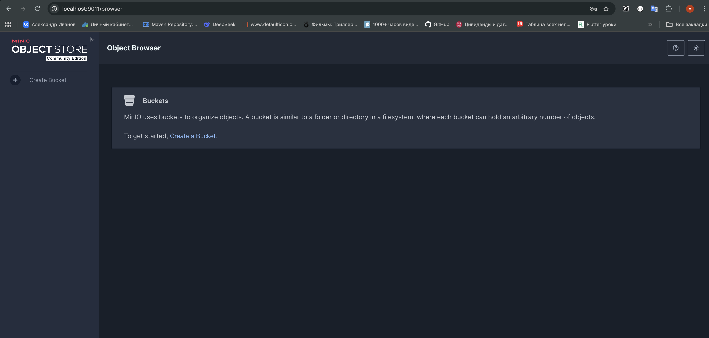
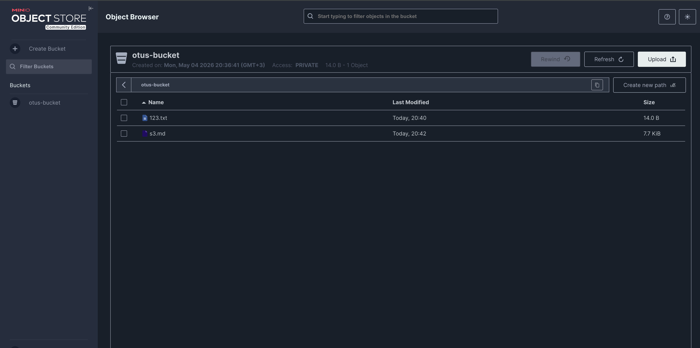
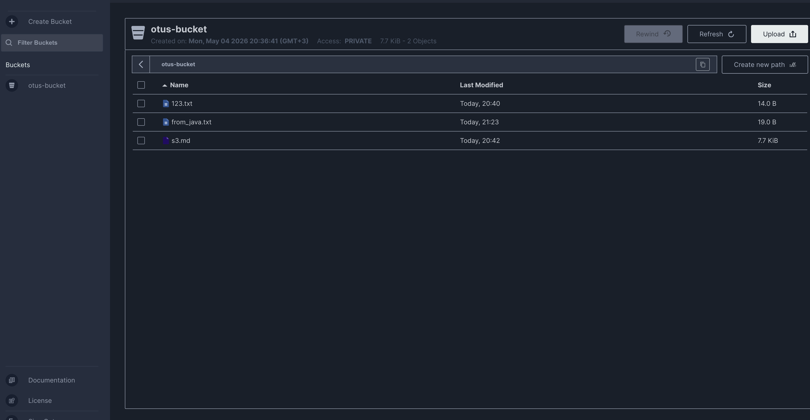

# Amazon S3 — Общие сведения

## 1. Что такое Amazon S3

Amazon S3 (Simple Storage Service) — это объектное хранилище данных от Amazon Web Services с открытым API, ставшим индустриальным стандартом. S3 позволяет хранить и извлекать любые объёмы данных из любой точки мира через HTTP.

Сервис был запущен в 2006 году и стал первым публично доступным сервисом AWS. Сегодня S3-совместимый API поддерживается десятками систем хранения — как облачных (Google Cloud Storage, Azure Blob Storage), так и self-hosted (MinIO, Ceph).

### Ключевые характеристики

- **Тип**: Объектное хранилище (Object Storage)
- **Модель данных**: Объекты (файлы + метаданные) в бакетах (buckets)
- **Масштабируемость**: Практически неограниченный объём данных
- **Доступность**: 99.99% для стандартного класса хранения
- **Долговечность**: 99.999999999% (11 девяток) — данные реплицируются по нескольким зонам доступности
- **Доступ**: HTTP REST API, AWS SDK, AWS CLI
- **Основные кейсы**: Хранение файлов, резервные копии, статика для сайтов, Data Lake, архивы

### Основные концепции

**Бакет (Bucket)**. Контейнер для хранения объектов. Имя бакета глобально уникально в рамках всего AWS. Аналог корневой директории.

**Объект (Object)**. Единица хранения в S3 — это файл + метаданные. Каждый объект идентифицируется ключом (key) внутри бакета. Максимальный размер объекта — 5 ТБ.

**Ключ (Key)**. Уникальное имя объекта внутри бакета. Может содержать `/`, что визуально создаёт иерархию папок, но физически S3 — плоское хранилище.

**Класс хранения (Storage Class)**. S3 предлагает несколько классов с разным балансом стоимости и доступности:
- `Standard` — горячие данные, частый доступ
- `Standard-IA` — редкий доступ, дешевле хранение
- `Glacier` — архивное хранение, дешево, но долгое восстановление

**Версионирование (Versioning)**. При включении S3 хранит все версии объекта, что защищает от случайного удаления и перезаписи.

**Политики доступа (Bucket Policy / ACL)**. Управление доступом на уровне бакета и объектов. Поддерживает публичный доступ, IAM-политики и presigned URLs.

**Presigned URL**. Временная подписанная ссылка для доступа к приватному объекту без авторизации — удобно для раздачи файлов пользователям.

**Multipart Upload**. Загрузка больших файлов по частям параллельно — ускоряет upload и позволяет возобновлять прерванные загрузки.

### CAP-теорема

Amazon S3 исторически был **AP-системой** (Availability + Partition tolerance) с eventual consistency для некоторых операций. С декабря 2020 года S3 обеспечивает **strong consistency** для всех операций чтения и записи — то есть после успешной записи объект сразу доступен для чтения в актуальном виде.

---

## 2. Для чего использовать S3

### Идеальные сценарии

**Хранение медиафайлов и статики**. Изображения, видео, CSS, JS — S3 отлично подходит для раздачи статического контента через CDN (CloudFront).

**Резервные копии и архивы**. Надёжное долговременное хранение бэкапов БД, логов, снапшотов с настраиваемым retention.

**Data Lake**. S3 — стандартная основа для Data Lake: хранение сырых данных в любых форматах (JSON, CSV, Parquet, ORC) для последующей обработки (Spark, Athena, ClickHouse).

**Дистрибуция артефактов**. Хранение и раздача бинарных артефактов, Docker-образов, ML-моделей, пакетов.

**Статические сайты**. S3 поддерживает хостинг статических сайтов напрямую из бакета.

**Интеграция с аналитикой**. ClickHouse, Spark, Presto, Athena умеют читать данные напрямую из S3 — удобно для построения аналитических пайплайнов.

### Когда НЕ стоит использовать S3

**Частые мелкие обновления файлов**. S3 не предназначен для замены файловой системы — каждое изменение создаёт новую версию объекта.

**Низкая задержка на чтение**. Для операций с задержкой < 1 мс лучше in-memory хранилища (Redis) или локальные SSD.

**Реляционные данные и транзакции**. S3 — не база данных, нет SQL, транзакций и индексов.

**Большое количество мелких файлов**. Стоимость операций PUT/GET может быть высокой при миллионах мелких объектов — лучше объединять их в архивы.

### Реальные примеры использования

- **Netflix**: хранение видеоконтента и артефактов деплоя
- **Airbnb**: фотографии объявлений, Data Lake для аналитики
- **Dropbox**: долгое время использовал S3 для хранения пользовательских файлов
- **ClickHouse**: встроенная поддержка чтения данных из S3 через табличную функцию `s3()`
- **Любой стартап**: стандартный выбор для хранения пользовательских файлов

---

## Краткое резюме

Amazon S3 — это надёжное, масштабируемое и дешёвое объектное хранилище с индустриально-стандартным API. Оно идеально для хранения файлов, бэкапов, медиа и Data Lake, но не заменяет базы данных или файловые системы там, где нужны транзакции, частые обновления или минимальные задержки.

---

## 3. Выполнение домашнего задания
### Для начала создадим Docker Compose и развернем Docker Container.
```yml
version: '3.8'

services:
  minio:
    image: minio/minio:latest
    container_name: minio-otus
    ports:
      - "9010:9000"
      - "9011:9001"
    environment:
      MINIO_ROOT_USER: minioadmin
      MINIO_ROOT_PASSWORD: minioadmin
    command: server /data --console-address ":9001"
    volumes:
      - minio_data:/data

volumes:
  minio_data:
  ```
  

  ### Настроим подключение:
  ```bash
  docker exec -it minio-otus mc alias set local http://localhost:9000 minioadmin minioadmin

mc: Configuration written to `/tmp/.mc/config.json`. Please update your access credentials.
mc: Successfully created `/tmp/.mc/share`.
mc: Initialized share uploads `/tmp/.mc/share/uploads.json` file.
mc: Initialized share downloads `/tmp/.mc/share/downloads.json` file.
Added `local` successfully.
```
### Создадим бакет.
```bash
docker exec -it minio-otus mc mb local/otus-bucket

Bucket created successfully `local/otus-bucket`.
```
### Загрузим файл в бакет.

### При помощи AWS SDK for Java v2  запишем файл в S3 и выводим список файлов, находящихся в S3.

