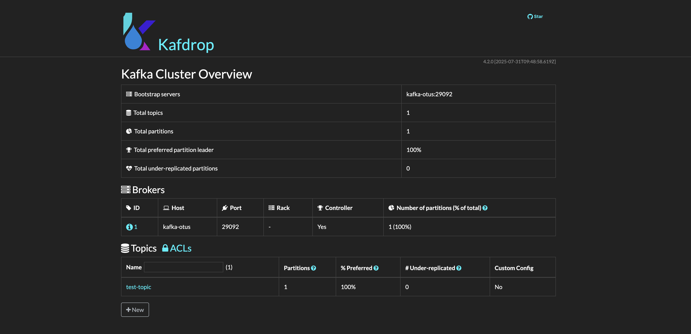
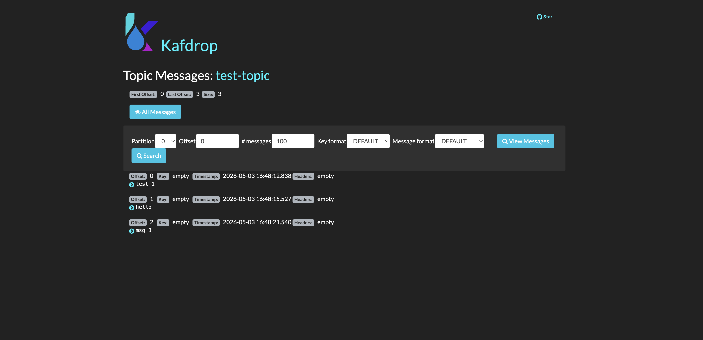

# Apache Kafka — Общие сведения

## 1. Что такое Apache Kafka

Apache Kafka — это распределённая платформа потоковой передачи данных (distributed event streaming platform) с открытым исходным кодом. Kafka позволяет публиковать, хранить, обрабатывать и подписываться на потоки событий в реальном времени.

Проект был создан в LinkedIn в 2010 году и передан в Apache Software Foundation. Сегодня Kafka является стандартом де-факто для построения высоконагруженных event-driven систем, потоковой интеграции между сервисами и сбора данных в реальном времени.

### Ключевые характеристики

- **Тип**: Distributed event streaming platform / message broker
- **Модель данных**: Лог событий, разбитый на топики и партиции
- **Производительность**: Очень высокая — миллионы сообщений в секунду
- **Персистентность**: Сообщения хранятся на диске с настраиваемым retention (по времени или размеру)
- **Масштабируемость**: Горизонтальная через партиционирование и добавление брокеров
- **Гарантии доставки**: At most once / At least once / Exactly once (зависит от настроек)
- **Основные кейсы**: Event streaming, интеграция сервисов, сбор логов и метрик, CDC, real-time аналитика

### Основные концепции

**Топик (Topic)**. Логический канал, в который пишут продюсеры и из которого читают консьюмеры. Аналог очереди, но с сохранением истории.

**Партиция (Partition)**. Топик делится на партиции — упорядоченные, неизменяемые последовательности сообщений. Партиции — единица параллелизма и масштабирования в Kafka.

**Offset**. Уникальный порядковый номер сообщения внутри партиции. Консьюмер сам управляет своим offset'ом, что позволяет перечитывать сообщения.

**Брокер (Broker)**. Сервер Kafka, который хранит данные и обслуживает запросы продюсеров и консьюмеров. Кластер состоит из нескольких брокеров.

**Продюсер (Producer)**. Клиент, который публикует сообщения в топик.

**Консьюмер (Consumer)**. Клиент, который читает сообщения из топика. Объединяются в Consumer Group для параллельного чтения.

**Consumer Group**. Группа консьюмеров, совместно читающих топик. Каждая партиция в один момент времени читается только одним консьюмером из группы — это обеспечивает балансировку нагрузки.

**Zookeeper / KRaft**. Исторически Kafka использовала Apache Zookeeper для хранения метаданных и координации кластера. Начиная с Kafka 2.8 доступен встроенный режим KRaft (без Zookeeper), который стал стандартом с Kafka 3.x.

**Replication Factor**. Количество копий каждой партиции на разных брокерах. Обеспечивает отказоустойчивость.

### CAP-теорема

Kafka позиционируется как **CP-система** (Consistency + Partition tolerance):

- Гарантирует порядок сообщений внутри партиции и согласованность данных между репликами.
- При сетевом разделении (partition) или отказе лидера партиции возможна временная недоступность записи до завершения перевыбора лидера.
- Доступность (Availability) приносится в жертву в пользу согласованности данных.

---

## 2. Для чего использовать Kafka

### Идеальные сценарии

**Event streaming и event-driven архитектура**. Kafka — основа для построения систем, где сервисы общаются через события, а не через прямые вызовы. Обеспечивает декаплинг продюсеров и консьюмеров.

**Интеграция микросервисов**. Замена синхронных REST/gRPC-вызовов между сервисами на асинхронный обмен сообщениями с гарантиями доставки.

**Сбор логов, метрик и событий**. Централизованный сбор данных из множества источников с буферизацией и дальнейшей доставкой в хранилища (ClickHouse, Elasticsearch, S3 и др.).

**Change Data Capture (CDC)**. Kafka Connect позволяет захватывать изменения из реляционных БД (Debezium) и реплицировать их в другие системы.

**Real-time аналитика**. Kafka Streams и ksqlDB позволяют обрабатывать потоки событий в реальном времени — агрегации, joins, обогащение данных.

**Очереди задач с историей**. В отличие от классических очередей (RabbitMQ), Kafka хранит сообщения на диске, позволяя перечитывать их и воспроизводить историю.

### Когда НЕ стоит использовать Kafka

**Простые очереди задач**. Для небольших нагрузок с простой маршрутизацией лучше подойдут RabbitMQ или Redis Streams — Kafka избыточна по сложности эксплуатации.

**Точечные запросы к данным**. Kafka — это не база данных. Поиск конкретного сообщения по содержимому — неудобен и неэффективен.

**Маленькие объёмы сообщений с низкой частотой**. Накладные расходы на инфраструктуру Kafka оправданы при высоком throughput.

**Строгая маршрутизация сообщений**. Для сложной топологии роутинга (fanout, dead-letter, TTL-очереди) RabbitMQ гибче из коробки.

### Реальные примеры использования

- **LinkedIn**: источник создания — обработка пользовательских событий и activity feeds
- **Netflix**: потоковая обработка событий, мониторинг, CDC
- **Uber**: событийная архитектура сервисов реального времени
- **Airbnb**: интеграция микросервисов, сбор аналитики
- **Яндекс, Сбер, ВТБ**: внутренние event-driven платформы

---

## Краткое резюме

Apache Kafka — это высокопроизводительная распределённая платформа для потоковой передачи событий. Она идеально подходит для интеграции микросервисов, сбора данных и real-time обработки событий. Kafka обеспечивает высокий throughput, надёжное хранение сообщений и гибкое масштабирование, но требует грамотной эксплуатации и оправдана при высоких нагрузках или сложных event-driven сценариях.

---

## 3. Выполнение домашнего задания

### 3.1 Развернем кавкал в докере:
```yml
version: '3.8'

services:
  zookeeper:
    image: confluentinc/cp-zookeeper:7.6.0
    container_name: zookeeper
    environment:
      ZOOKEEPER_CLIENT_PORT: 2181
      ZOOKEEPER_TICK_TIME: 2000
    ports:
      - "2181:2181"

  kafka:
    image: confluentinc/cp-kafka:7.6.0
    container_name: kafka-otus
    depends_on:
      - zookeeper
    ports:
      - "9092:9092"
      - "29092:29092"
    environment:
      KAFKA_BROKER_ID: 1
      KAFKA_ZOOKEEPER_CONNECT: zookeeper:2181
      KAFKA_LISTENER_SECURITY_PROTOCOL_MAP: PLAINTEXT:PLAINTEXT,PLAINTEXT_HOST:PLAINTEXT
      KAFKA_ADVERTISED_LISTENERS: PLAINTEXT://kafka-otus:29092,PLAINTEXT_HOST://localhost:9092
      KAFKA_OFFSETS_TOPIC_REPLICATION_FACTOR: 1
      KAFKA_AUTO_CREATE_TOPICS_ENABLE: 'true'

  kafdrop:
    image: obsidiandynamics/kafdrop
    container_name: kafdrop
    restart: "no"
    ports:
      - "9000:9000"
    environment:
      KAFKA_BROKERCONNECT: "kafka-otus:29092"
    depends_on:
      - kafka

```
***Для работы с Kafka кластером будем использовать kafdrop.***
### Создадим топик.

```bash
docker exec -it kafka-otus kafka-topics --create --topic test-topic --bootstrap-server localhost:9092 --partitions 1 --replication-factor 1
```


### Отправим сообщение в топик.

```bash
docker exec -it kafka-otus kafka-console-producer --topic test-topic --bootstrap-server localhost:9092
```

